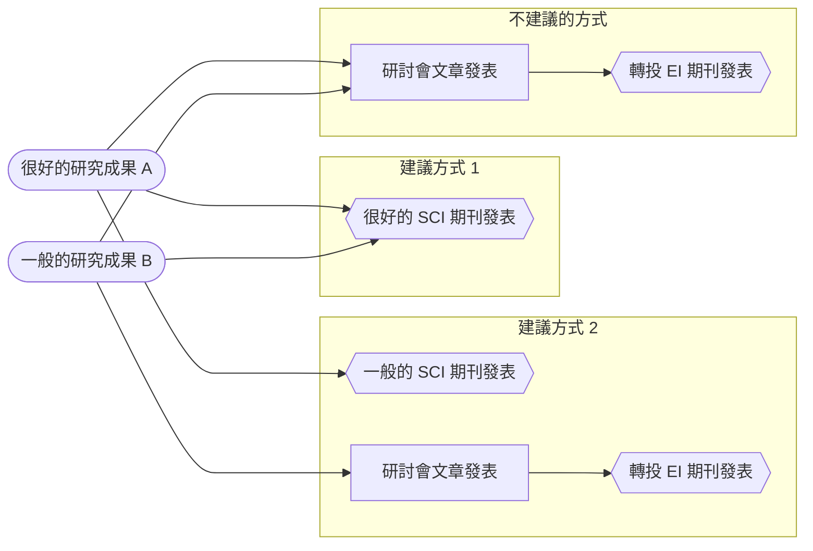

本項筆記為就讀博士期間撰寫之課程筆記。  
課程使用之教科書為：  
> Wallace, S. (2014). <i>How to Attend, Speak or Present a Poster at an Academic Conference</i> (Third Edition). Wallace Academic Editing. https://textbooks.tw/products/how-to-attend-speak-or-present-a-poster-at-an-academic-conference-third-edition

26/02/2024 14:35
# 研究數據管理
在做研究時，不一定研究數據都值得發表最好的 SCI 期刊的內容，可能的發表執行方式如下：

# 如何確定一個研討會是大型研討會還是小型研討會?
1. **依據議程辦理期程**：通常大於二日的為大型研討會。
2. **依據截稿日與會議日**：截稿日與研討會會議日期之間的間隔若小，顯示文章在 Review 程序花的時間少，通常表示為小型研討會。
3. **依據委員會成員**：委員會成員組成若皆為同一個國家通常不是國際研討會。
4. **依據研討會主要義題**：通常大型研討會主題單一，其中可能依照專業細節分配不同組別。而不會存在大量相關性較低的領域。