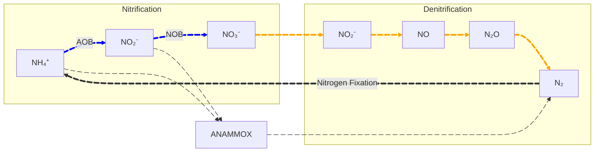

# 9 硝化 (Nitrification)
- **定義**：微生物氧化 $\rm NH_4^+$，使 $\rm (Ammonium)\ NH_4^+\to (Nitrite)\ NO_2^-\to (Nitrate)\ NO_3^-$ 之過程。  
  由於 $\rm NH_4^+$ 對水體巨型微生物具有毒性，其氧化也消耗一定的氧氣量 ($4.57\ g_{O_2}/g_{NH_4^+}$)，因此部分廢水中的 $\rm NH_4^+$ 去除有法規規定。

- **用途**：硝化與脫硝過程，目的為將 $\rm NH_4^+$ 及其他氮氧化物，轉化為氮氣排放。
	$$
	\underbrace{\ce{N^{}H4+_{\small (-3)}->[硝化(AOB)]NO2-_{\small (+3)}->[硝化(NOB)]NO3-_{\small (+5)}}}_{\text{硝化}}\ce{->}
	$$

	$$ 
	\underbrace{\ce{NO3-_{\small (+5)}->[脫硝]NO2-_{\small (+3)}->[脫硝]NO_{\small (+2)}->[脫硝]N2O_{\small (+1)}->[脫硝]N2_{\small (0)}}}_{\text{脫硝}}
	$$

- 硝化過程：
	- 氨氧化 ($\rm NH_4^+\to NO_2^-$) Ammonia-Oxidizing Bacteria (氨氧化菌, **AOB**)：
		- $\ce{1/6NH4+ + 1/4O2->[AOB] 1/6NO2- + 1/3H+ +1/6H2O}$
		- 包含：<ins>Nitroso</ins>monas；<ins>Nitroso</ins>coccus；<ins>Nitroso</ins>lobus；<ins>Nitroso</ins>spira；<ins>Nitroso</ins>vibrio
	- 亞硝酸氧化($\rm NO_2^-\to NO_3^-$) Nitrite-Oxidizing Bacteria (亞硝酸氧化菌, **NOB**)：
	  - $\ce{1/2NO2- + 1/4O2->[NOB] 1/2NO3-}$
	  - 包含：<ins>Nitro</ins>spira；<ins>Nitro</ins>spina；<ins>Nitro</ins>coccus；<ins>Nitro</ins>cystis；<ins>Nitro</ins>bactor
	
- **特性**：
	- Nitrifying bacteria(硝化菌)為 chemolitho**autotrophic**(化學==自營==)之==絕對好氧菌==。使用無機碳作為碳源，無機物（氮氧化物）作為電子提供者，收量較低。
	- AOB、NOB 兩種菌常共存在相同環境，且生長參數大多相似。
	- 一般而言，只要 **SRT 夠長**，**溶氧足夠**即可達硝化作用。
	- 硝化菌大多產生的 SMP 為 BAP，其中 SMP 具有表 **「硝化菌在衰解」**、**「提供異營菌額外碳源，使異營菌之 biomass 增加」** 之重要性。
	- 容易受到許多化合物的抑制，包括：
		- 未解離的 $\rm NH_3$(當 pH 高時)
		- 未解離的 $\rm HNO_2$(當 pH 時)
		- 陰離子界面活性劑
		- 重金屬
		- 含氯有機物
		- 低 pH
	- 混合營(Mixotrophy)：硝化菌利用有機與無機碳源作為電子提供者。
	
- 硝化過程
  - 成功的硝化成需須將一營菌與硝化菌競爭**溶氧**與**空間**考量在內(克服方法：延長污泥齡(>15 天))：
    - 硝化菌的高 $K_O$(氧氣親和性)，使其不易競爭氧氣。
    - 低生長速率(收量 Y 較低)使其不易競爭空間。
  - One-Sludge 硝化槽 (計算題會考)
    - 特點：
      - 包括**異營菌**和**硝化菌**共存於一個系統。
      - **氨和有機物 BOD** 同時被氧化去除。
      - 會有互相搶食之現象，其中以**異營菌**競爭力較強。
      - 由於生長較緩慢，因此需**較長的 SRT**，**需氧量也較大**。
  - Two-sludge 硝化槽
    - 特點：
	  - 由兩個活性污泥系統組成。
	  - 分成兩個階段以減少細菌間競爭，通常較單污泥系統優。
	  - 在第一階段氧化大部份的有機物 (BOD)；第二階段氧化氨。
  - 進流水 $\rm BOD_L:TKN\ Ratio$
    - $\rm BOD_L$: $\rm TKN$ Ratio 影響消化系統的方法
      - 異營菌合成 Biomass 時會減少硝化作用使用的氮量。
        - 若 $\frac{BOD}{TKN}>25\ \frac{g_{BOD}}{g_{TKN}}$，則僅剩下少量氨氮供硝化作用進行。
      - 決定活性污泥中硝化菌的比例。
      - 決定異營菌與硝化菌競爭空間與氧氣。
  - **ANAMMOX**：厭氧氨氧化菌
    - 包含：*Planctomycetes* 菌屬
    - 原理：$\ce{NH4^+-N_{\left(-3\right)} + {NO_2^-}_{(+3)} -> {N_2}_{(0)} + H2O}$
      - Electron donor: $\rm NH_4^+$
	  - Electron acceptor: $\rm NO_2^-$

# 10 脫硝 (Denitrification)
- Denitrification(脫硝作用)：

  - 微生物將 $\rm NO_3^-$ 或 $\rm NO_2^-$ 還原成 $\rm N_2$ 的過程。其中 $\rm NO_3^-$ 或 $\rm NO_2^-$ 為電子接受者，行脫硝的菌種可以是自營或異營菌。脫硝作用對於水體有防止優養化之重要性。
    - 反應如：$\ce{NO3- + 2e- + 2H+ \to NO2- + H2O}$
    - 脫硝菌皆屬 **兼性耗氧菌**，指在氧氣不足情形下，可使用 $\ce{NO3-}$ 或 $\ce{NO2-}$ 作為電子接受者。(脫硝菌將優先使用氧氣，固有氧氣會影響脫硝作用進行。)
    - 氧氣濃度將影響脫硝作用：
      - **氮還原酵素基因會受溶氧抑制 (DO > 2.5 mg/L)**
      - **氮還原酵素活性會受抑制 (DO > 0.1 mg/L)**
    - **低濃度電子提供者**與**高濃度溶氧**，容易導致脫硝中產物累積。
    - 脫硝菌雖通常不對 pH 敏感，但在 pH 中性範圍外，容易導致中產物累積。
      - 脫硝作用產生**鹼度(Alkalinity)**，但鹼度產生前度受電子提供者影響，若水體原始緩衝能力不強，可能會產生鹼度問題。
    - 異營脫硝菌與一般好養異營菌的操作參數差異不大，僅 Y 與 $f_s^0$ 略小。
    - 包含：
      - 革蘭氏陰性菌：*Proteobacteria* 屬，包含 (*Pseudomonas*、*Alcaligenes*、*Paracoccus*、*Thiobacillus*)
      - 革蘭氏陰性菌：Bacillus
      - 古細菌：Halobacterium
  - 脫硝程序類型(主要差異在是否添加額外電子提供者)
    - Tertiary (需額外添加電子提供者)： 
      - 適合使用含有 $\rm NO_3^-$ 或 $\rm NO_3^-$ 但電子提供者(BOD)濃度相當低的水體。
      - 添加電子提供者如：
        - 有機：甲醇等有機碳廢水。
        - 無機：氫氣(適合脫硝自營菌)、還原性硫化物。
    - One-sludge (廢水中已有電子提供者)：
      - 利用近流廢水中的 BOS 驅動脫硝作用。
      - 優點：
        - 無須額外添加電子提供者，可節省藥劑費用。
        - 以 $\rm NO_3^-$ 作為電子接受者，節省部分曝氣費用。
        - 可同時去除氮，出流水不會造成優養化。
      - 由於進流廢水一般含有 BOD 與 TKN，TKN 於好養下進行氧化，而 BOD 同時氧化，為求有剩餘 BOD 供 One-sludge 脫硝程序進行，**策略**為：
        - 生質物的儲存與衰解
          - 原理：利用微生物儲存之便當或藉由微生物的 decay(內呼吸)獲得脫硝所需電子提供者。
          - 缺點：
            - 內呼吸作用提供動力不高($b=0.05\ day^{-1}$)，需要大量 MLSS 與長 HRT。
            - decay 細胞會釋放 $\rm NH_4^+$，處理過的廢水可能仍有一定濃度的氮(無法進行硝化作用再次去除)。
        - 預硝化 (主流方法)
          - 原理：利用無氧在耗氧策略，進流廢水先進如氧單元進行脫硝，未氧化完全的 BOD 與產生的 $\rm NH_4^+$ 再流入好氧槽進一步氧化與硝化。
          - 優點：節省曝氣費用，出流水不含 $\rm NH_4^+$。
          - 缺點：迴流 MLSS 高，管線維護費用高。
        - 同時硝化與脫硝 (SND)
          - 原理：利用溶氧濃度控制(< 1 mg/L)，使消化與脫硝同時進行(BOD 氧化亦可進行)。
          - 優點：與預消化優點相同，亦改善其高 MLSS 迴流濃度之缺點。
          - 缺點，相關操作參數需要進一步建立。
      - 常見程序：
        - **Barnard**  
          - ==程序==：  
            
            1. 預硝化 (缺氧脫硝 > 好氧硝化)
            2. 生質物儲存與衰減 (缺氧脫硝)
            3. 將 $\rm NH_4^+$ 硝化成 $\rm NO_3^-$ (好氧硝化) 

        - Sequencing batch reactor (SBR)
        - Biofilm (生物膜)
    - Two-sludge system (雙污泥系統)

  
<a href="03_微生物動力學">< Last</a>

  

  
<a href="11_除磷">Next ></a>

