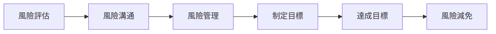
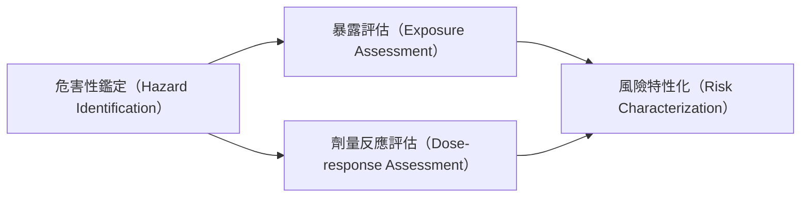

# 1.1 風險之表示方法
- 死亡事故（Fatality）。
- 生命預期損失（Loss of Life Expectancy, LLE）：指當人口平均壽命為基線時，風險可表示為減少平均壽命之強度。
- 事故發生件數。
- 事件發生頻率。
- 致死事故率（Fatal Accident Rate, FAR）：在某危害工作做中暴露 $10^8\ hr$，曾發生或預期發生事故死亡之人數（其中，$10^8\ hr$ 表 $1,000$ 名工人一生的工時。每人工作量假設為：$50\ \frac{year}{Worker}\cdot 50\ \frac{week}{year}\cdot 5\ \frac{weekday}{week} \cdot 8\ \frac{hr}{weekday} = 10^5\ hr$）。故：  
$$
FAR = \frac{死亡人數}{10^8\ 工作小時}
$$
- 百萬分之一致死分險（One-in-a-million Risks of Death）：發生事故並且產生百萬分之一致死的機率所需要的時間或是活動強度。

# 1.2 風險管理
基本程序：

## 1.2.1 風險評估
基本程序：

1. **危害性鑑定**（Hazard Identification）：  
了解污染物之來源、特性及對健康之影響。
2. **劑量反應評估**（Dose-response Assessment）：  
針對污染物毒性，了解不同暴露程度造成何種健康問題。
3. **暴露評估**（Exposure Assessment）：  
探討污染物傳輸機制、途徑與濃度。了解人體在依訂時間內透過不同途徑吸收多少污染物。
4. **風險特性化**（Risk Characterization）：  
彙整資訊，評估目標人體因污染物暴露造成之風險（致癌、慢性病）。
## 1.2.2 風險溝通
透過溝通，使具爭議性的環境議題形成多數人能夠接受的結論，以作出最有效風險決策。使得：
- 強化自我防禦機制，增進配合與支持。
- 促使決策者與利害關係人達成共識。
- 提供潛在受害者危害告知。
- 指導緊急事故之應變方式。
- 改善目標族群之風險認識。
- 改善目標族群風險接受度。
- 避免風險爭議發生衝突。

  
<a href="00_簡介_風險管理">< Last</a>

  

  
<a href="02_暴露評估">Next ></a>

